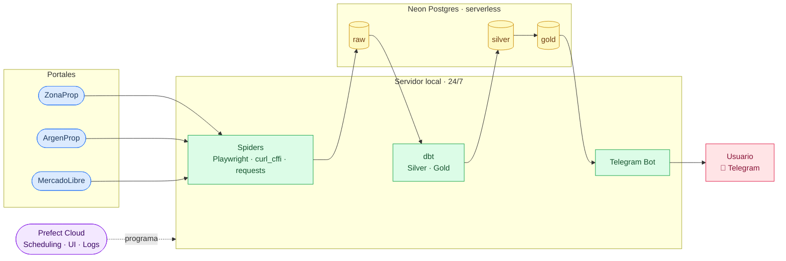

# Arquitectura Rent Radar

```mermaid
flowchart LR
    subgraph portales["Portales"]
        ZP([ZonaProp])
        AP([ArgenProp])
        ML([MercadoLibre])
    end

    subgraph local["Servidor local · 24/7"]
        direction LR
        SPD["Spiders\nPlaywright · curl_cffi · requests"]
        DBT["dbt\nSilver · Gold"]
        BOT["Telegram Bot"]
    end

    subgraph neon["Neon Postgres · serverless"]
        direction TB
        RAW[("raw")]
        SIL[("silver")]
        GOL[("gold")]
    end

    PC(["Prefect Cloud\nScheduling · UI · Logs"])
    USER["Usuario\n📱 Telegram"]

    ZP & AP & ML --> SPD
    SPD --> RAW
    RAW --> DBT --> SIL --> GOL
    GOL --> BOT --> USER

    PC -. programa .-> local

    classDef portal    fill:#dbeafe,stroke:#3b82f6,color:#1e3a5f
    classDef proceso   fill:#dcfce7,stroke:#16a34a,color:#14532d
    classDef db        fill:#fef9c3,stroke:#ca8a04,color:#713f12
    classDef cloud     fill:#f3e8ff,stroke:#9333ea,color:#3b0764
    classDef user      fill:#ffe4e6,stroke:#e11d48,color:#881337

    class ZP,AP,ML portal
    class SPD,DBT,BOT proceso
    class RAW,SIL,GOL db
    class PC cloud
    class USER user
```
