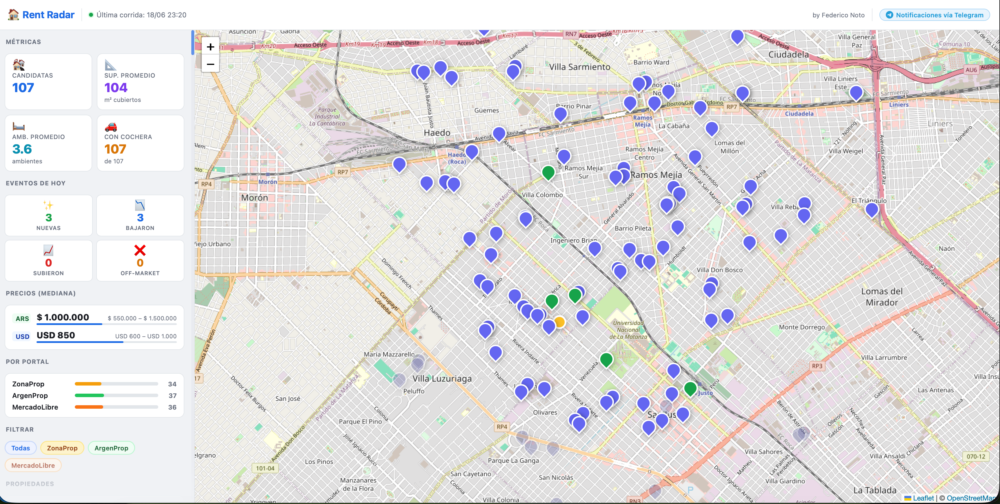
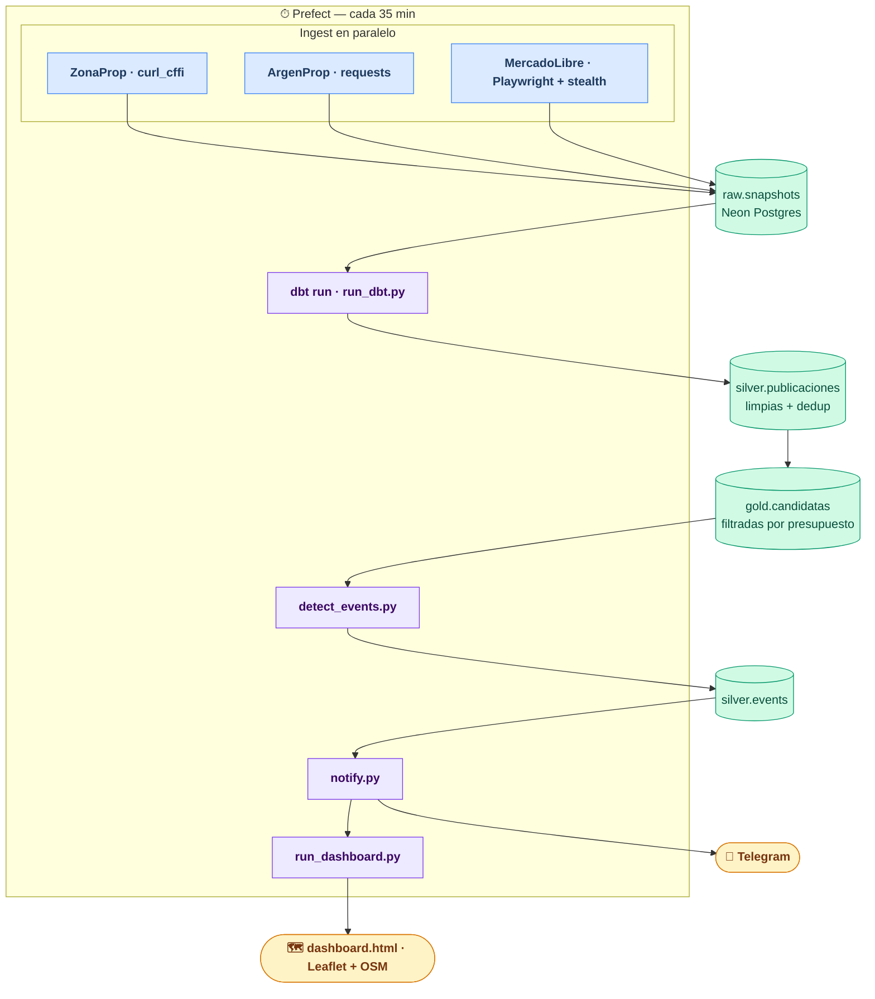

# Rent Radar

> **Automated rental monitoring for the Argentine market.**
> Scrapes three major portals, transforms the data with dbt, detects price changes and new listings, and delivers Telegram notifications — running every 35 minutes on a self-hosted server.


---



---

## ¿Qué hace?

1. **Scraping** — tres spiders corren en paralelo cada 35 minutos y persisten snapshots crudos en Neon Postgres.
2. **Transformación** — dbt limpia, deduplica y enriquece en capas `silver` y `gold`.
3. **Detección de eventos** — compara runs consecutivos y emite eventos tipados: `NEW`, `PRICE_DOWN`, `PRICE_UP`, `EXPENSES_CHANGE`, `CURRENCY_CHANGE`, `OFF_MARKET`.
4. **Notificaciones** — mensajes formateados por Telegram, con reintento automático si el envío falla.
5. **Mapa interactivo** — `dashboard.html` con Leaflet + OpenStreetMap, con live-reload cuando se regenera.

---

## Arquitectura



**Schemas en Neon Postgres:**

| Schema | Tablas | Descripción |
|--------|--------|-------------|
| `raw` | `pipeline_runs`, `snapshots` | Salida directa de los spiders |
| `silver` | `publicaciones`, `publicaciones_rechazadas`, `events`, `notifications` | Datos limpios + auditoría |
| `gold` | `candidatas`, `metricas` | Propiedades filtradas por presupuesto y criterios · métricas de la última corrida |

---

## Stack

| Capa | Tecnología | Detalle |
|------|------------|---------|
| Scraping | `curl_cffi` | Impersonación de Chrome — ZonaProp |
| Scraping | `Playwright` + `playwright-stealth` | Browser automation con bypass de bot detection — MercadoLibre |
| Scraping | `requests` + `BeautifulSoup4` | HTTP liviano — ArgenProp |
| Base de datos | Neon Postgres (serverless) | 3 schemas, pool de conexiones |
| Transformaciones | dbt-postgres | Limpieza, deduplicación cross-portal, filtros |
| Orquestación | Prefect self-hosted | Server + worker vía systemd |
| Notificaciones | Telegram Bot API | Multi-chat, retry automático |
| Visualización | Leaflet.js + OpenStreetMap | Mapa con popups y live-reload |

---

## Decisiones técnicas destacadas

**Deduplicación cross-portal**
La misma propiedad puede aparecer en ZonaProp, ArgenProp y MercadoLibre simultáneamente. `silver/publicaciones.sql` detecta duplicados por bucket geográfico (±0.001° lat/lon), ambientes, moneda y precio (±10%), y los consolida en una sola fila.

**OFF_MARKET con ventana de 3 runs**
Una propiedad marcada como no disponible después de ausencia en una sola corrida generaría muchos falsos positivos (los portales reordenan resultados constantemente). El evento `OFF_MARKET` solo se emite si la propiedad estuvo ausente en las últimas 3 corridas consecutivas (~2h15m).

**Tipo de cambio dinámico**
`run_dbt.py` consulta la API de dolarapi.com antes de cada run y pasa el tipo de cambio USD como variable dbt, permitiendo filtrar por presupuesto en pesos usando cotización actualizada automáticamente.

**Timeout de inactividad por spider**
`run_ingest.py` monitorea la última actividad de cada spider. Si un proceso lleva más de 120 segundos sin emitir resultados, se lo termina forzosamente para no bloquear el pipeline completo.

---

## Instalación

### Requisitos

- Python 3.13
- Cuenta en [neon.tech](https://neon.tech) (free tier alcanza)
- Bot de Telegram ([@BotFather](https://t.me/BotFather))

```bash
python3.13 -m venv venv
source venv/bin/activate
pip install -e .
playwright install chromium
```

### Base de datos

Crear un proyecto en Neon y aplicar las migraciones en orden:

```bash
psql $NEON_DATABASE_URL -f sql/001_init_schemas.sql
psql $NEON_DATABASE_URL -f sql/002_silver_events.sql
```

### Variables de entorno

```bash
cp .env.example .env
# Editar .env con los valores reales
```

### dbt

Agregar en `~/.dbt/profiles.yml`:

```yaml
analytics:
  target: dev
  outputs:
    dev:
      type: postgres
      host: <host>.neon.tech
      user: neondb_owner
      password: "{{ env_var('DBT_PASSWORD') }}"
      port: 5432
      dbname: neondb
      schema: public
      threads: 4
      sslmode: require
```

### Servicios systemd

Los archivos en `systemd/` son plantillas. Reemplazar los placeholders antes de copiar:

- `YOUR_USER` → usuario Linux (ej. `noto`)
- `YOUR_PROJECT_DIR` → ruta absoluta del repo
- `YOUR_SERVER_IP` → IP del servidor en la LAN (solo en `prefect-server.service`)

```bash
sudo cp systemd/*.service /etc/systemd/system/
sudo systemctl daemon-reload
sudo systemctl enable --now prefect-server prefect-worker rent-radar-map
```

### Registrar el pipeline en Prefect

Solo la primera vez:

```bash
PREFECT_API_URL=http://127.0.0.1:4200/api prefect work-pool create --type process local
PREFECT_API_URL=http://127.0.0.1:4200/api prefect deploy pipeline.py:pipeline \
  --name cada_35min --pool local --interval 2100
```

---

## Uso

### Pipeline completo manual

```bash
python run_ingest.py                       # scrape los tres portales en paralelo
python run_dbt.py                          # transforma con dbt (tipo de cambio auto)
python detect_events.py                    # detecta cambios entre última y anteúltima corrida
python notify.py                           # envía eventos pendientes por Telegram
python run_dashboard.py                     # genera dashboard.html con métricas
```

### Un solo portal

```bash
python run_ingest.py --source zonaprop
```

### Mapa con servidor local

```bash
python run_dashboard.py --serve --port 8080
# → http://localhost:8080/dashboard.html
```

### Logs en tiempo real

```bash
sudo journalctl -u prefect-worker -f
```

---

## Estado

- [x] Spiders: ZonaProp, ArgenProp, MercadoLibre
- [x] Pipeline dbt: raw → silver → gold
- [x] Detección de eventos (6 tipos)
- [x] Notificaciones Telegram con encabezado por corrida
- [x] Mapa interactivo con live-reload
- [x] Orquestación Prefect self-hosted
- [ ] Filtros en el frontend del mapa
- [ ] Tabla de métricas en gold
