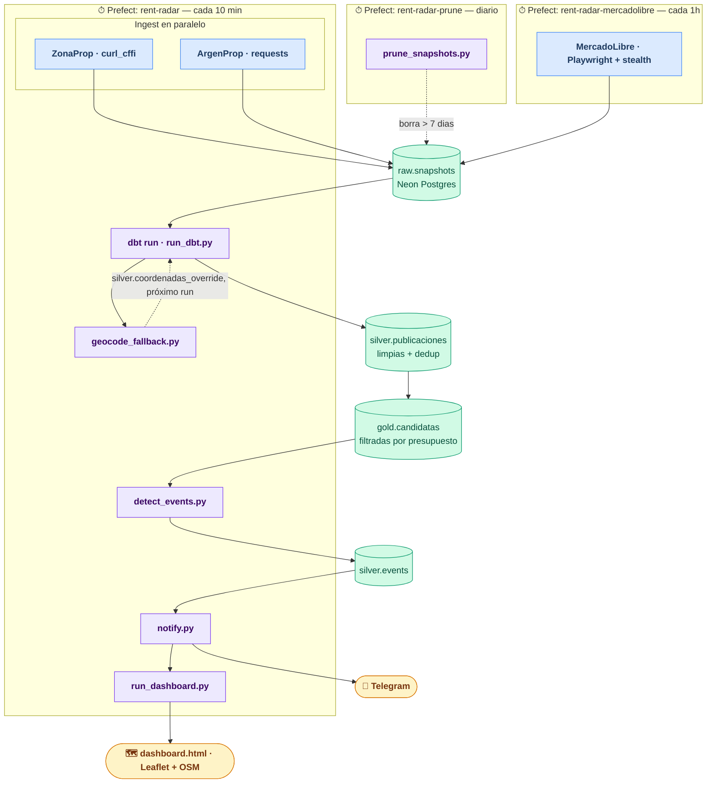

# Rent Radar

> **Automated rental monitoring for the Argentine market.**
> Scrapes three major portals, transforms the data with dbt, detects price changes and new listings, and delivers Telegram notifications — ZonaProp and ArgenProp run every 10 minutes, MercadoLibre runs separately every hour to avoid anti-bot blocks, all on a self-hosted server.


---


---

## ¿Qué hace?

1. **Scraping** — ZonaProp y ArgenProp corren en paralelo cada 10 minutos; MercadoLibre corre en un flow de Prefect separado cada hora (Playwright es más lento y el portal aplica bloqueos anti-bot si se lo scrapea muy seguido). Todos persisten snapshots crudos en Neon Postgres.
2. **Transformación** — dbt limpia, deduplica y enriquece en capas `silver` y `gold`, tomando la última corrida con datos útiles de cada portal de forma independiente.
3. **Detección de eventos** — compara runs consecutivos y emite eventos tipados: `NEW`, `PRICE_DOWN`, `PRICE_UP`, `EXPENSES_CHANGE`, `CURRENCY_CHANGE`, `OFF_MARKET`.
4. **Notificaciones** — mensajes formateados por Telegram, con reintento automático si el envío falla.
5. **Dashboard** — `dashboard.html` con Leaflet + OpenStreetMap, métricas (mediana de precios, eventos recientes, indicador de datos desactualizados por portal) y live-reload cuando se regenera.

---

## Arquitectura



**Schemas en Neon Postgres:**

| Schema | Tablas | Descripción |
|--------|--------|-------------|
| `raw` | `pipeline_runs`, `snapshots` | Salida directa de los spiders |
| `silver` | `publicaciones`, `publicaciones_rechazadas`, `events`, `notifications`, `health_alerts`, `property_flags`, `coordenadas_override`, `coordenadas_no_resueltas` | Datos limpios + auditoría |
| `gold` | `candidatas`, `metricas` | Propiedades filtradas por presupuesto y criterios · métricas de la última corrida |

---

## Stack

| Capa | Tecnología | Detalle |
|------|------------|---------|
| Scraping | `curl_cffi` | Impersonación de Chrome — ZonaProp |
| Scraping | `Playwright` + `playwright-stealth` | Browser automation con bypass de bot detection — MercadoLibre |
| Scraping | `requests` + `BeautifulSoup4` | HTTP liviano — ArgenProp |
| Base de datos | Neon Postgres (serverless) | 3 schemas, pool de conexiones |
| Transformaciones | dbt-postgres | Limpieza, deduplicación cross-portal, filtros |
| Orquestación | Prefect self-hosted | Server + worker vía systemd |
| Notificaciones | Telegram Bot API | Multi-chat, retry automático |
| Visualización | Leaflet.js + OpenStreetMap | Mapa con popups y live-reload |

---

## Decisiones técnicas destacadas

**Deduplicación cross-portal y dentro del mismo portal**
La misma propiedad puede aparecer en ZonaProp, ArgenProp y MercadoLibre simultáneamente, o repostearse dos veces en el mismo portal (inmobiliarias que vuelven a publicar el mismo aviso con otro id). `silver/publicaciones.sql` detecta ambos casos con el mismo criterio: bucket geográfico (±0.001° lat/lon), ambientes, moneda y precio (±10%), y consolida en una sola fila quedándose con la de especificaciones más completas.

**OFF_MARKET con ventana de tiempo real, no de corridas**
Marcar como no disponible a una propiedad ausente en una sola corrida genera falsos positivos: ZonaProp reordena resultados en vivo (avisos destacados que rotan) mientras el spider pagina, así que una propiedad puede faltar 1-2 corridas sin haberse dado de baja. `detect_events.py` exige `OFF_MARKET_MIN_HOURS` (2 horas) de ausencia continua confirmada en *todas* las corridas intermedias antes de emitir `OFF_MARKET`, en vez de contar un número fijo de corridas — así el margen no depende de la cadencia de cada portal (10 min en ZonaProp/ArgenProp, ~1h en MercadoLibre) y no hay que recalibrarlo si esa cadencia cambia.

**MercadoLibre en un flow propio**
Playwright scrapea MercadoLibre con delays anti-bot que pueden llevar 20-30 minutos, y el portal aplica bloqueos si se lo golpea con la misma frecuencia que los otros dos. Por eso corre en su propio flow de Prefect (`mercadolibre_pipeline`) con un intervalo independiente, sin bloquear la cadencia rápida del resto del pipeline.

**Una corrida sin datos útiles no cuenta como "ok"**
Si el scraper devuelve publicaciones sin precio (por ejemplo porque la página de detalle también quedó bloqueada), `main.py` marca esa corrida como `empty` en vez de `ok`. Como `silver/publicaciones.sql` y `detect_events.py` solo consideran corridas `ok` para determinar "la última con datos", esto evita que un bloqueo temporal tire a 0 las propiedades de un portal en el dashboard o dispare falsos `OFF_MARKET` en cadena.

**Tipo de cambio dinámico**
`run_dbt.py` consulta la API de dolarapi.com antes de cada run y pasa el tipo de cambio USD como variable dbt, permitiendo filtrar por presupuesto en pesos usando cotización actualizada automáticamente. El valor usado en cada corrida queda en `gold.metricas.tipo_cambio_usd_usado` — antes solo se imprimía en el log de esa corrida de Prefect, sin quedar registrado en ningún lado consultable.

**Timeout de inactividad por spider**
`run_ingest.py` monitorea la última actividad de cada spider. Si un proceso lleva más de 120 segundos sin emitir resultados, se lo termina forzosamente para no bloquear el pipeline completo.

**Alerta de fuente desactualizada**
`check_health.py` corre al final de cada pipeline y usa los mismos umbrales que el badge "desactualizado" del dashboard (90 min ZonaProp/ArgenProp, 150 min MercadoLibre) para avisar por Telegram cuando una fuente deja de tener corridas `ok`. La alerta se manda una sola vez por episodio (`silver.health_alerts` guarda el estado) y se avisa también cuando la fuente se recupera, para no spamear cada 10 minutos mientras el bloqueo persiste.

**Ningún paso roto debe tapar la alerta de salud**
`check_health` es el único paso cuyo trabajo es avisar de fallas, así que no puede ser una víctima más de la falla de otro paso. `pipeline()` ya no deja que el ingest (`f.result(raise_on_failure=False)`) ni dbt/geocode_fallback/detect_events/notify/dashboard (`_try_step`) tiren abajo el flow completo — cada uno corre best-effort y, si falla, el resto sigue igual ese ciclo. Esto salió de dos incidentes reales: un corte de DNS hacia Neon que tumbó el ingest, y la base llena que tumbó dbt — en ambos casos un paso anterior reventaba el flow entero antes de llegar a `check_health`.

Pero queda un caso límite: si la base está totalmente inalcanzable, `check_health.py` tampoco puede conectarse para chequear nada. Por eso tiene su propio fallback: si falla por completo, avisa por Telegram igual ("no pude completar el chequeo") usando un marcador en disco (no en la base, que es justo lo que no anda) para no repetir el aviso cada 10 minutos mientras el corte persiste, y avisa también cuando logra reconectar.

**Retención de `raw.snapshots`**
Cada corrida guarda una fila por publicación (cada ~10 min en ZonaProp/ArgenProp), sin límite — esto hizo que el proyecto chocara el tope de almacenamiento de Neon (512 MB en el free tier) y dejara de poder escribir nada, frenando ingest y dbt por igual. `prune_snapshots.py` borra lo de más de `RETENTION_DAYS` (7) días y corre en un flow propio (`rent-radar-prune`, una vez por día) independiente de ambos ingests — ni hace falta podarlo tan seguido, ni la limpieza debe depender de la salud de ningún scraper en particular. Un índice en `fecha_scraping` (`sql/007`) evita que el borrado escanee toda la tabla.

**Sparkline de precio sin tabla nueva**
El popup de cada propiedad en el mapa muestra un mini-gráfico con el historial de precio, armado a partir de `raw.snapshots` (no hace falta una tabla histórica nueva: cada corrida ya guarda su propio snapshot). Solo se grafican los puntos con la misma moneda que el precio actual, para que un `CURRENCY_CHANGE` no se vea como un salto de precio gigante.

**"Me interesa" / "Descartar" compartido entre dispositivos**
Marcar una propiedad como interesante o descartada se guarda en `silver.property_flags`, no en el navegador — así se ve igual entrando desde el celular o la notebook. Por eso `run_dashboard.py --serve` deja de ser un simple file server: agrega `GET /api/estados` (estado fresco al cargar la página, sin esperar la próxima regeneración del HTML) y `POST /api/estado` (guarda el click). Sin esto, el dashboard sería HTML estático puro; con esto, ese único proceso necesita credenciales de Neon y acepta escritura desde cualquiera en la LAN — aceptable para un uso casero, pero vale tenerlo presente.

**Coordenadas mal geocodificadas por el portal, corregidas sin intervención manual**
A veces el portal de origen le pone a una dirección correcta unas coordenadas absurdas (a kilómetros, o directamente en otra provincia) — no es un bug nuestro, es el geocodificador del portal. `silver/publicaciones.sql` calcula en cada corrida la mediana de lat/lon de las propias publicaciones (sin centro fijo hardcodeado: si las zonas de búsqueda en `run_ingest.py` cambian, el centro se recalcula solo) y rechaza con motivo `coordenadas_fuera_de_zona` lo que esté a más de 4x la mediana de distancia a ese centro (piso 5km). `geocode_fallback.py` corre después de cada `dbt run` y reintenta ubicar esas direcciones contra Nominatim (OpenStreetMap); si el resultado cae dentro de zona, lo guarda en `silver.coordenadas_override`, que `publicaciones.sql` prefiere sobre la coordenada del portal desde la corrida siguiente. Si Nominatim tampoco puede, se avisa una sola vez por publicación vía Telegram (`silver.coordenadas_no_resueltas` evita repetir el aviso cada 10 minutos) para revisarla a mano.

---

## Instalación

### Requisitos

- Python 3.13
- Cuenta en [neon.tech](https://neon.tech) (free tier alcanza)
- Bot de Telegram ([@BotFather](https://t.me/BotFather))

```bash
python3.13 -m venv venv
source venv/bin/activate
pip install -e .
playwright install chromium
```

### Base de datos

Crear un proyecto en Neon y aplicar las migraciones en orden:

```bash
psql $NEON_DATABASE_URL -f sql/001_init_schemas.sql
psql $NEON_DATABASE_URL -f sql/002_silver_events.sql
psql $NEON_DATABASE_URL -f sql/003_health_alerts.sql
psql $NEON_DATABASE_URL -f sql/004_property_flags.sql
psql $NEON_DATABASE_URL -f sql/005_coordenadas_override.sql
psql $NEON_DATABASE_URL -f sql/006_coordenadas_no_resueltas.sql
psql $NEON_DATABASE_URL -f sql/007_snapshots_fecha_index.sql
```

### Variables de entorno

```bash
cp .env.example .env
# Editar .env con los valores reales
```

### dbt

Agregar en `~/.dbt/profiles.yml`:

```yaml
analytics:
  target: dev
  outputs:
    dev:
      type: postgres
      host: <host>.neon.tech
      user: neondb_owner
      password: "{{ env_var('DBT_PASSWORD') }}"
      port: 5432
      dbname: neondb
      schema: public
      threads: 4
      sslmode: require
```

### Servicios systemd

Los archivos en `systemd/` son plantillas. Reemplazar los placeholders antes de copiar:

- `YOUR_USER` → usuario Linux (ej. `noto`)
- `YOUR_PROJECT_DIR` → ruta absoluta del repo
- `YOUR_SERVER_IP` → IP del servidor en la LAN (solo en `prefect-server.service`)

```bash
sudo cp systemd/*.service /etc/systemd/system/
sudo systemctl daemon-reload
sudo systemctl enable --now prefect-server prefect-worker rent-radar-map
```

### Registrar el pipeline en Prefect

Solo la primera vez:

```bash
PREFECT_API_URL=http://127.0.0.1:4200/api prefect work-pool create --type process local
PREFECT_API_URL=http://127.0.0.1:4200/api prefect deploy pipeline.py:pipeline \
  --name cada_10min --pool local --interval 600
PREFECT_API_URL=http://127.0.0.1:4200/api prefect deploy pipeline.py:mercadolibre_pipeline \
  --name meli_cada_1h --pool local --interval 3600
PREFECT_API_URL=http://127.0.0.1:4200/api prefect deploy pipeline.py:prune_pipeline \
  --name limpieza_diaria --pool local --cron "0 8 * * *"
```

---

## Uso

### Pipeline completo manual

```bash
python run_ingest.py                       # scrape los tres portales en paralelo
python prune_snapshots.py                  # borra snapshots de mas de 7 dias (normalmente corre 1x/dia aparte)
python run_dbt.py                          # transforma con dbt (tipo de cambio auto)
python geocode_fallback.py                 # reintenta ubicar publicaciones con coordenadas fuera de zona
python detect_events.py                    # detecta cambios entre última y anteúltima corrida
python notify.py                           # envía eventos pendientes por Telegram
python run_dashboard.py                     # genera dashboard.html con métricas
```

### Un solo portal

```bash
python run_ingest.py --source zonaprop
```

### Mapa con servidor local

```bash
python run_dashboard.py --serve --port 8080
# → http://localhost:8080/dashboard.html
```

### Logs en tiempo real

```bash
sudo journalctl -u prefect-worker -f
```

